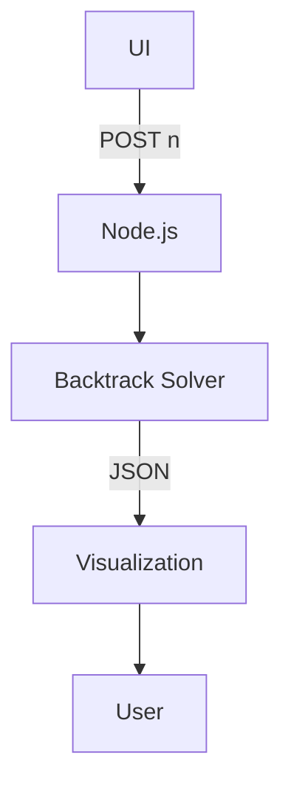

```markdown
---
marp: true
theme: dracula
headingDivider: 2
paginate: true
---

# N-Queens Visualizer
### A Modern Web-Based Puzzle Solver


---

## The Challenge

- Place N chess queens on an N×N board
- No two queens threaten each other
- Classic CS problem since 1848

**Why It Matters:**
- Tests algorithmic thinking
- Foundation for constraint satisfaction
- Benchmark for backtracking efficiency


---

## Technical Stack

| Frontend          | Backend         |
|-------------------|-----------------|
| HTML5/CSS3 Grid   | Node.js         |
| Vanilla ES6+ JS   | Express         |
| Font Awesome      | REST API        |
| Google Fonts      | JSON responses  |


---

## System Architecture



---

## Backend Algorithm

```javascript
function backtrack(row) {
  if (row === n) saveSolution();
  for (let col = 0; col < n; col++) {
    if (isSafe(row, col)) {
      placeQueen(row, col);
      backtrack(row + 1);
      removeQueen(row, col); // Backtrack
    }
  }
}
```

*O(n!) time complexity*

---

## API Design

`POST /solve`
```json
{
  "n": 8
}
```

**Response:**
```json
{
  "count": 92,
  "solutions": [
    [[0,1],[1,3],[2,5],...]
  ]
}
```

---

## Key Features

- Dynamic board generation
- Solution navigation
- Real-time metrics
- Mobile responsive
- Dark mode UI


---

## UI/UX Decisions

- **Dark theme** (#121212 bg)
- **Accent color**: Purple (#8a63ff)
- **Micro-interactions**:
  - Button hover effects
  - Smooth transitions
- **Chess-inspired**:
  - Queen icons
  - Board styling

---

## Visualization Engine

```javascript
// CSS Grid board
board.style.gridTemplateColumns = `repeat(${n}, 1fr)`;

// Queen placement
cell.innerHTML = `
  <div class="queen">
    <i class="fas fa-chess-queen"></i>
  </div>`;
```

---

## State Management

```javascript
let solutions = []; // All solutions
let currentIdx = 0; // Position tracker

function showSolution(idx) {
  placeQueens(solutions[idx]);
  updateCounter(); // "3/92 solutions"
}
```

---

## Performance

| N  | Time (ms) | Solutions |
|----|-----------|-----------|
| 4  | 1.2       | 2         |
| 8  | 15.8      | 92        |
| 12 | 1426.4    | 14,200    |

*Exponential growth evident*

---

## Error Handling

**Client-side:**
```javascript
if (n < 1 || n > 12) {
  showError("Please enter 1-12");
}
```

**Server-side:**
```javascript
if (isNaN(n)) {
  res.status(400).json({ error: "Invalid N" });
}
```

---

## Testing Approach

- **Manual Tests**:
  - N=1 (edge case)
  - N=12 (max)
  - Non-integer inputs
- **Future**:
  - Jest unit tests
  - Cypress E2E

---

## Future Roadmap

- Web Workers for background solving
- 3D visualization (Three.js)
- User accounts
- Algorithm comparisons
- Multi-language support


---

## Lessons Learned

1. Backtracking teaches clean recursion
2. CSS Grid > Canvas for simple boards
3. Minimal dependencies = better perf
4. Dark UI increases engagement

---

# Live Demo & Q&A

Try it: [your-url.com](https://your-url.com)  
Code: [github.com/your-repo](https://github.com/your-repo)

Questions?
```